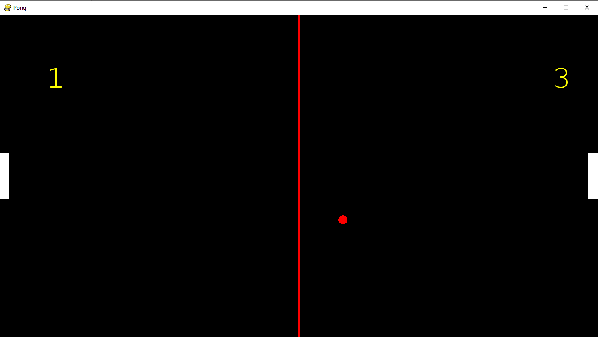

# CSC290-Pong

## Navigation

1. Description
2. Installation
3. Playing Pong
4. Make Pong Better 
5. Authors
6. License

Welcome, Pong-ers! Get ready to re-experience the first-ever arcade game. Below, you will find instructions on how to install and play this amazing game. Happy Pong-ing!

## Installation
Step 1: Install pygame, and a Python IDE

Step 2:  Download our repo

Step 3: Run the PongG.py file

## Playing Pong
This is a two-player Human vs. Human game. The “W” and “S” keys control the paddle on the left and the “UP” and “DOWN” arrow keys control the paddle on the right. A point is scored when either player gets the ball past their opponent’s paddle. The game is played until one of the players gets 5 points. Once a player gets 5 points, they win the game. Players have the option to restart by clicking the “SPACEBAR” key after the game is over.

## Make Pong Better
There are several ways to extend this game. You can choose to add different levels of robot players in order to make it harder for the player to win. You can also add different kinds of barriers on the map so that it is harder to bounce the ball back to the opponent's area. Another way you can extend this game is to rotate the player's paddle while they are playing the game, so that it is harder for them to reach the ball.

## Authors and their Contribution

**Maham Khan**  
Some major components of this game are the paddles that are controlled by the players. My contribution to the game was creating the Paddle class that represents these paddles. This class has the initializer that takes in a position on the game screen (for the pddles to be placed) and two keys (s or w, up or down) that will be pressed to move the paddles. I also created a method for moving the paddles up and down. This method determines which key is pressed and moves the paddle accordingly by a certain amount that we specified in the game. For this readme.md, I created the 'Navigation' section and added to it the different components of this file. I also created the 'Liscense' section and a copy of our license. Finally, I created the 'Authors and their Contribution' section.

**BingMing Zhang**  
My contribution to the game is creating the Design class that sets up the starting screen for the player. This class takes the position of the mouse and checks if it clicks on the button. If the player clicks on the play button, it takes the player to the ingame screen, and if the player clicks on the quit button, the window will be closed. This class also contains information about how to play this game. For the readme.md, I did the part explaining how to extend this game to another level. I also created the "How to extend" section.

**Tomiwa Olasoko**  
I designed the Ball class and added functionality to speed up the ball in a given direction. I was also responsible for the Installation and Playing Pong portions of this README.

## License

A copy of our license can be found as a seperate file in our repository.
